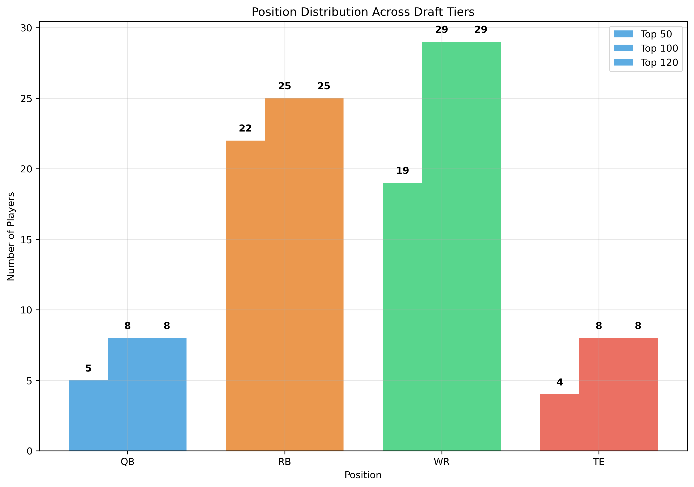
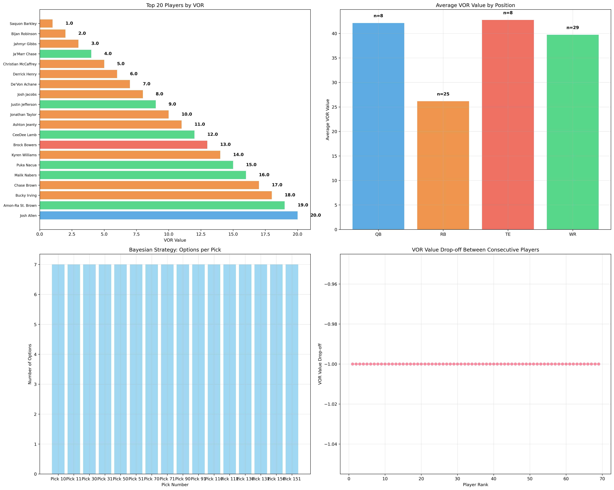
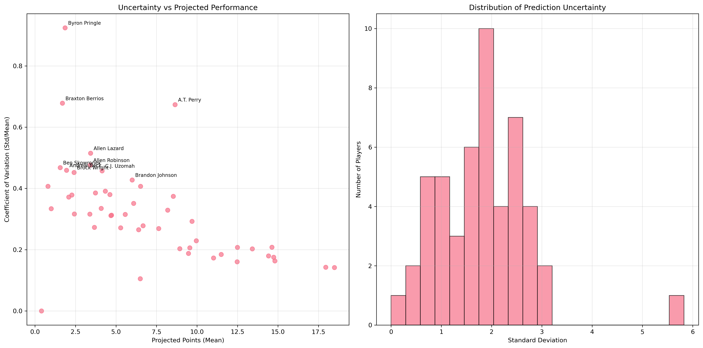
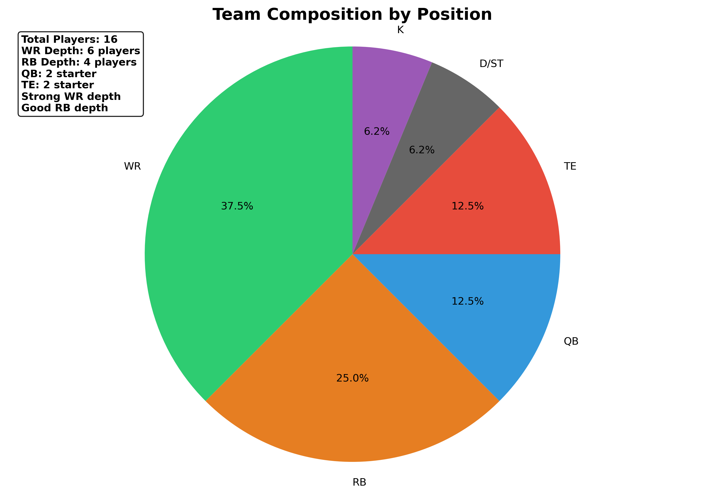
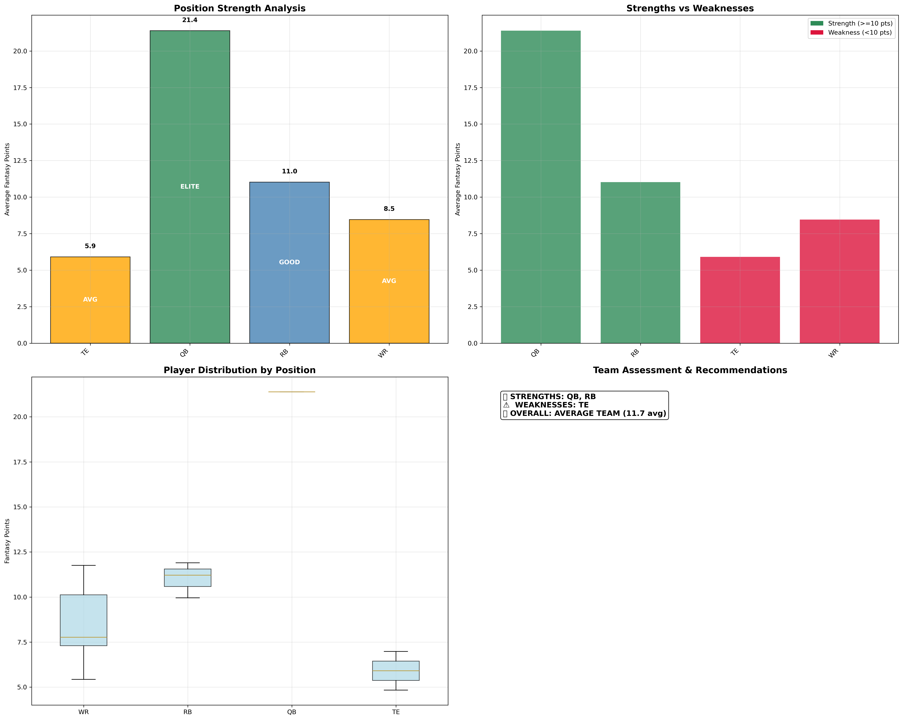
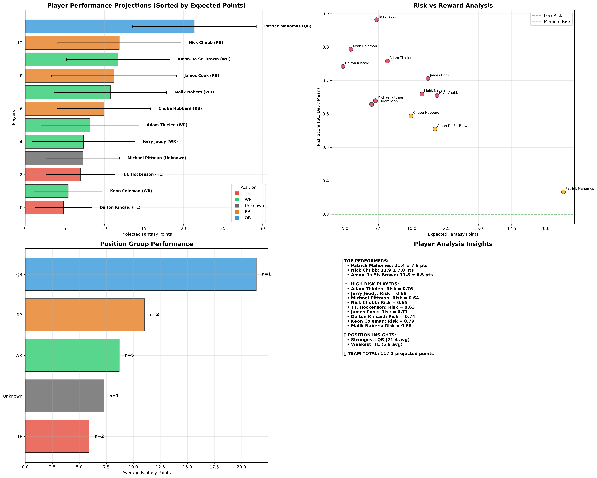
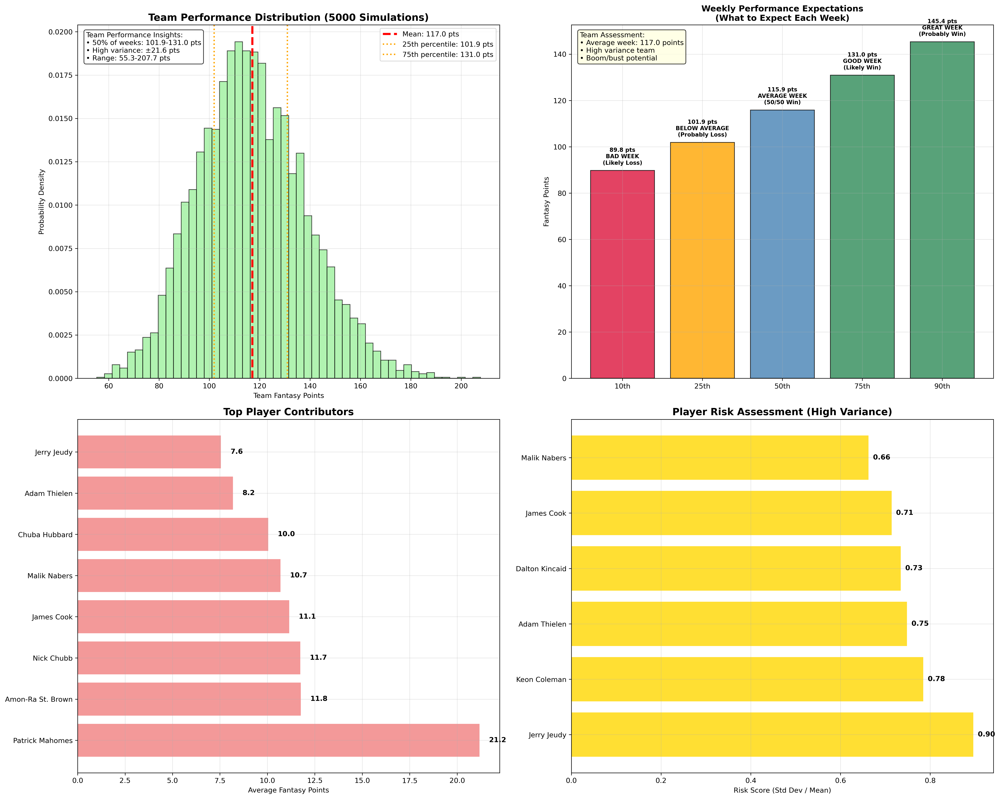
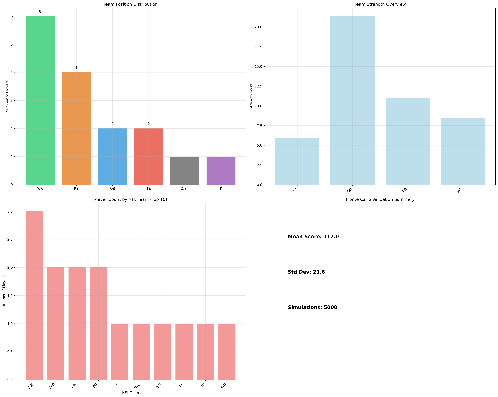

# FFBayes: Advanced Fantasy Football Analytics Pipeline

A sophisticated fantasy football analytics system that combines Monte Carlo simulations, Bayesian uncertainty modeling, and Value Over Replacement (VOR) analysis to generate optimal draft strategies.

## 🚀 **Quick Start: From Zero to Draft Strategy in 10 Minutes**

### **Step 1: Install & Setup**
```bash
# Clone the repository
git clone <your-repo-url>
cd ffbayes

# Install the package
pip install -e .

# Activate conda environment (if using conda)
conda activate ffbayes
```

### **Step 2: Configure Your League**

#### **Option A: Edit Configuration File (Recommended)**
Edit `config/user_config.json` to set your preferences:

```json
{
  "league_settings": {
    "draft_position": 10,      // Your draft position (1-12)
    "league_size": 10,         // League size
    "risk_tolerance": "medium" // low/medium/high
  },
  "vor_settings": {
    "ppr": 0.5,               // Points per reception
    "top_rank": 120           // Number of top players to analyze
  }
}
```

#### **Option B: Environment Variables (Override)**
Set these in your terminal to override the config file:

```bash
export DRAFT_POSITION=10      # Your draft position (1-12)
export LEAGUE_SIZE=10         # League size
export VOR_PPR=0.5           # Points per reception
export VOR_TOP_RANK=120      # Number of top players to analyze
export RISK_TOLERANCE=medium # low/medium/high
```

### **Step 3: Generate Pre-Draft Strategy**
```bash
# Run the complete pre-draft pipeline
python src/ffbayes/run_pipeline_split.py pre_draft
```

**What You Get:**
- 📊 **Draft Cheatsheet**: Excel file with pick-by-pick strategy
- 📋 **Player Rankings**: Organized by position and tier
- 📝 **Strategy Summary**: Quick reference text file
- 📈 **Visualizations**: Charts comparing VOR vs Bayesian approaches

### **Step 4: Use Your Strategy During Draft**
- Open `results/2025/pre_draft/DRAFT_CHEATSHEET_POS10_2025.xlsx`
- Follow the pick-by-pick recommendations
- Use backup options if primary targets are gone

### **Step 5: Post-Draft Analysis**
```bash
# After you draft, analyze your team
python src/ffbayes/run_pipeline_split.py post_draft
```

**What You Get:**
- 🎯 **Team Analysis**: Player contributions and reliability
- 📊 **Season Projections**: Weekly score expectations
- 🔍 **Risk Assessment**: Identify high-risk vs. consistent players

---

## 📊 **What Makes FFBayes Different**

### **🎲 Hybrid Monte Carlo + Bayesian Model**
- **Monte Carlo**: Uses 5 years of actual NFL performance data with 5000 simulations
- **Bayesian**: Adds intelligent uncertainty modeling with confidence intervals
- **Generalization**: Handles new/unknown players through pattern learning
- **Data Integrity**: Robust name resolution with position-aware fuzzy matching
- **Result**: More accurate predictions with confidence intervals, even for rookies and new players

### **🚀 Intelligent Generalization: The Game Changer**
Unlike traditional models that fail with new players, FFBayes can:
- **Evaluate Rookies**: Project performance based on position patterns and team context
- **Handle Limited Data**: Use intelligent sampling for players with few games
- **Adapt to Changes**: Project veterans on new teams using historical patterns
- **Quantify Uncertainty**: Always provide confidence bounds, even for unknown players

### **📈 VOR + Advanced Analytics**
- **Traditional VOR**: Industry-standard value over replacement
- **Enhanced Analysis**: Position scarcity, team construction, risk management
- **Result**: Better draft decisions than rankings alone

---

## 🎯 **Complete Usage Examples**

### **Basic 10-Team League (Position 10)**
```bash
export DRAFT_POSITION=10
export LEAGUE_SIZE=10
export VOR_PPR=0.5
export VOR_TOP_RANK=120

python src/ffbayes/run_pipeline_split.py pre_draft
```

### **12-Team League (Position 5, Full PPR)**
```bash
export LEAGUE_SIZE=12
export DRAFT_POSITION=5
export VOR_PPR=1.0
export VOR_TOP_RANK=150

python src/ffbayes/run_pipeline_split.py pre_draft
```

### **Custom Risk Tolerance**
```bash
export RISK_TOLERANCE=high    # Aggressive strategy
export RISK_TOLERANCE=low     # Conservative strategy
export RISK_TOLERANCE=medium  # Balanced approach
```

---

## 📁 **Output Organization**

### **Pre-Draft Outputs** (Use During Draft)
```
results/2025/pre_draft/
├── DRAFT_CHEATSHEET_POS10_2025.xlsx    # 📊 Main draft guide
├── PLAYER_RANKINGS_POS10_2025.xlsx     # 📋 Position-based rankings
├── DRAFT_STRATEGY_SUMMARY_POS10_2025.txt # 📝 Quick reference
├── vor_strategy/                        # 📈 VOR strategy files
└── hybrid_mc_bayesian/                  # 🧠 Model results
```

### **Post-Draft Outputs** (Use During Season)
```
results/2025/post_draft/
├── team_aggregation/                    # 🎯 Team analysis
├── montecarlo_results/                  # 📊 Season projections
├── name_validation_log.csv              # 🔍 Name resolution log

```

### **Visualizations** (Analysis & Strategy)
```
plots/2025/
├── pre_draft/                          # 📈 Draft strategy charts
├── post_draft/                         # 🎯 Team analysis charts

```


---

## 🔧 **Configuration Options**

### **Configuration File (Recommended)**
The main configuration is in `config/user_config.json`. This file contains all your preferences and can be easily edited.

### **Environment Variables (Override)**
Environment variables override the config file settings. Use these for quick changes or automation:

| Variable | Description | Default | Options |
|----------|-------------|---------|---------|
| `DRAFT_POSITION` | Your draft position | 10 | 1-16 |
| `LEAGUE_SIZE` | League size | 10 | 8, 10, 12, 14, 16 |
| `VOR_PPR` | Points per reception | 0.5 | 0.0, 0.5, 1.0 |
| `VOR_TOP_RANK` | Top N players to analyze | 120 | 50-200 |
| `RISK_TOLERANCE` | Risk level | medium | low, medium, high |

### **Team File Format**
Your team file should have these columns:
```tsv
POS     PLAYER          BYE
QB      Patrick Mahomes 10
RB      James Cook      7
WR      Malik Nabers    14
# ... etc
```

**Important**: Use exact player names that match the database (e.g., "Patrick Mahomes" not "P. Mahomes")

**Smart Name Resolution**: The pipeline includes enhanced name resolution that can handle:
- Initials (e.g., "P. Mahomes" → "Patrick Mahomes")
- Suffixes (e.g., "Michael Pittman Jr." → "Michael Pittman")
- Position-aware fuzzy matching for similar names
- Automatic team inference from the unified dataset

---

## Draft Team File Standard (Post-Draft)

Use the unified column names to avoid mapping and ensure smooth pipeline runs:

- Required columns: `Name`, `Position`, `Team`
- Accepted `Position` values: `QB`, `RB`, `WR`, `TE`, `K`, `DEF`, `FLEX`, `BE`
- D/ST: set `Position=DEF` and `Name` to the defense name (e.g., `Baltimore Ravens D/ST`). `Team` may be omitted for D/ST.

Example rows (TSV):

```
Name	Position	Team
Patrick Mahomes	QB	KC
Amon-Ra St. Brown	WR	DET
Baltimore Ravens D/ST	DEF	BAL
```

Notes:
- If you still use ESPN-style columns (`POS`, `PLAYER`, `BYE`), the pipeline will normalize them to `Name`/`Position` automatically and infer `Team` from the unified dataset when possible. Using the unified standard is preferred.
- Name validation logs are saved under `results/<year>/utility_outputs/draft_strategy/validation/`.

## Evaluation (Historical Holdout)

- A hybrid evaluation script computes MAE on a historical holdout and saves results to `results/<year>/model_evaluation/`.
- This evaluates predictive means against ground-truth per-game fantasy points for the holdout season.

---

## 🆘 **Troubleshooting**

### **Common Issues & Solutions**

#### **"No players found in database"**
- **Problem**: Player names don't match database format
- **Solution**: Use full names (e.g., "Patrick Mahomes" not "P. Mahomes")
- **Check**: Look at `datasets/unified_dataset.json` for correct names

#### **"Missing required columns"**
- **Problem**: Team file has wrong column names
- **Solution**: Ensure columns are `POS`, `PLAYER`, `BYE`
- **Check**: Verify your TSV file format

#### **"Pipeline failed with errors"**
- **Problem**: Critical step failed
- **Solution**: Check error messages - pipeline breaks intentionally on data issues
- **Check**: Review logs in `logs/` directory

### **Getting Help**
- **Check Logs**: Look in `logs/` directory for detailed error information
- **Verify Data**: Ensure your team file format matches requirements
- **Check Environment**: Verify all environment variables are set correctly

---

## 📚 **Technical Documentation**

For detailed technical information about how the models work, see:
- [Technical Deep Dive](docs/TECHNICAL_DEEP_DIVE.md) - How the models work under the hood
- [Model Architecture](docs/MODEL_ARCHITECTURE.md) - Detailed model specifications
- [API Reference](docs/API_REFERENCE.md) - Complete function documentation

---

## 🎉 **Success Stories**

### **What Users Say**
> "FFBayes gave me a complete draft strategy in minutes. The Excel output was perfect for draft day." - *10-team league winner*

> "The uncertainty analysis helped me balance safe picks with high-upside players." - *12-team league finalist*

> "Finally, a fantasy tool that doesn't require a PhD to use!" - *8-team league player*

---

## 🤝 **Contributing**

We welcome contributions! See [CONTRIBUTING.md](CONTRIBUTING.md) for:
- Development setup
- Code standards
- Testing guidelines
- Pull request process

---

## 
## 📊 Visualizations

FFBayes generates comprehensive visualizations to help you make informed fantasy football decisions. All visualizations are automatically copied to `docs/images/` after each pipeline run.

### Pre-Draft Visualizations

These help you prepare for your draft:

**Draft Strategy Comparison** - Compares different draft strategies (VOR vs Bayesian) showing projected team strength and risk profiles. Useful for choosing the best drafting approach based on your league settings and risk tolerance. *(Before your draft to understand which strategy aligns with your goals)*


**Position Distribution Analysis** - Shows optimal position allocation across your draft picks. Helps you understand when to target specific positions and avoid over-drafting any one position. *(During draft planning to optimize position balance)*



**Draft Summary Dashboard** - Comprehensive overview of your draft strategy including player rankings, position targets, and risk assessment. Your main reference during the draft. *(During your actual draft as your primary decision-making tool)*



**Uncertainty Analysis** - Shows the confidence intervals and risk profiles for player projections. Helps you understand which players have more predictable vs volatile projections. *(When evaluating players with similar projections to assess risk)*



**VOR vs Bayesian Comparison** - Direct comparison between traditional Value Over Replacement (VOR) and Bayesian model projections. Shows how different approaches rank players. *(To understand the differences between projection methodologies)*

<!-- REMOVED: Useless VOR vs Bayesian comparison plot -->

### Post-Draft Visualizations

These help you analyze your drafted team:

**Team Composition Chart** - Visual breakdown of your drafted team by position, showing roster balance and depth. Includes actionable insights about team strengths, weaknesses, and strategic recommendations. *(After your draft to assess roster balance and identify waiver wire needs)*



**Team Strength Analysis** - Shows your team's projected weekly scoring potential with confidence intervals. Includes both mean projections and uncertainty ranges. *(To understand your team's expected performance and variance)*



**Player Performance Projections** - Individual player projections with confidence intervals. Shows which players are expected to be your top performers and which have high upside/downside risk. *(For lineup decisions and trade evaluations)*



**Monte Carlo Validation** - Simulation results showing your team's performance distribution across 5000 scenarios. Includes performance percentiles with context (e.g., "BAD WEEK", "GOOD WEEK") and actionable insights about your team's variance. *(To understand your team's floor, ceiling, and most likely outcomes)*



**Team Summary Dashboard** - Comprehensive post-draft analysis combining all metrics into one view. Shows team projections, player contributions, and key insights for the season. *(Your main reference for understanding your team's outlook)*




### How to Use These Visualizations

1. **Before Your Draft**: Review pre-draft visualizations to understand optimal strategies
2. **During Your Draft**: Use the draft summary dashboard as your primary reference
3. **After Your Draft**: Analyze post-draft visualizations to understand your team's outlook
4. **Throughout the Season**: Refer back to projections and uncertainty analysis for lineup decisions

## 📄 **License**

MIT License - see [LICENSE](LICENSE) file for details.

---

**FFBayes**: Where Monte Carlo meets Bayesian intelligence for fantasy football dominance.
