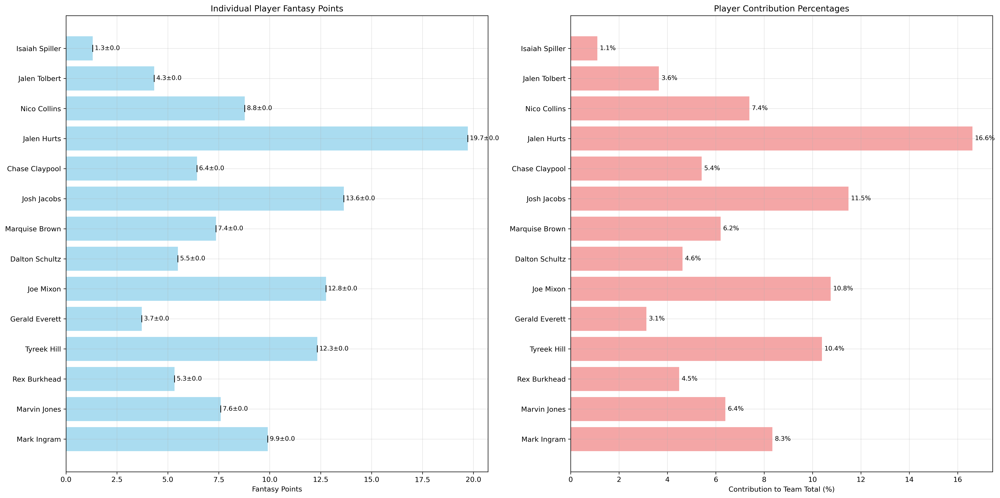
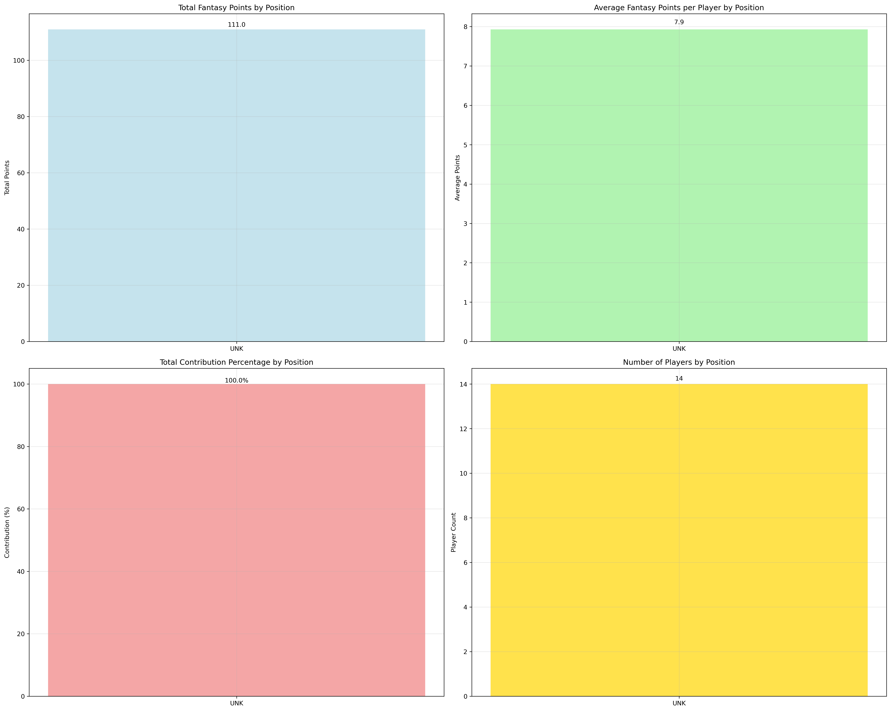
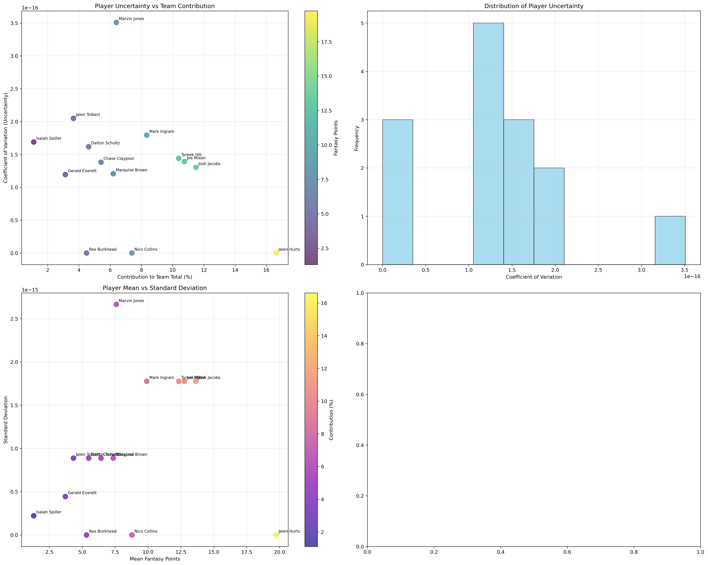
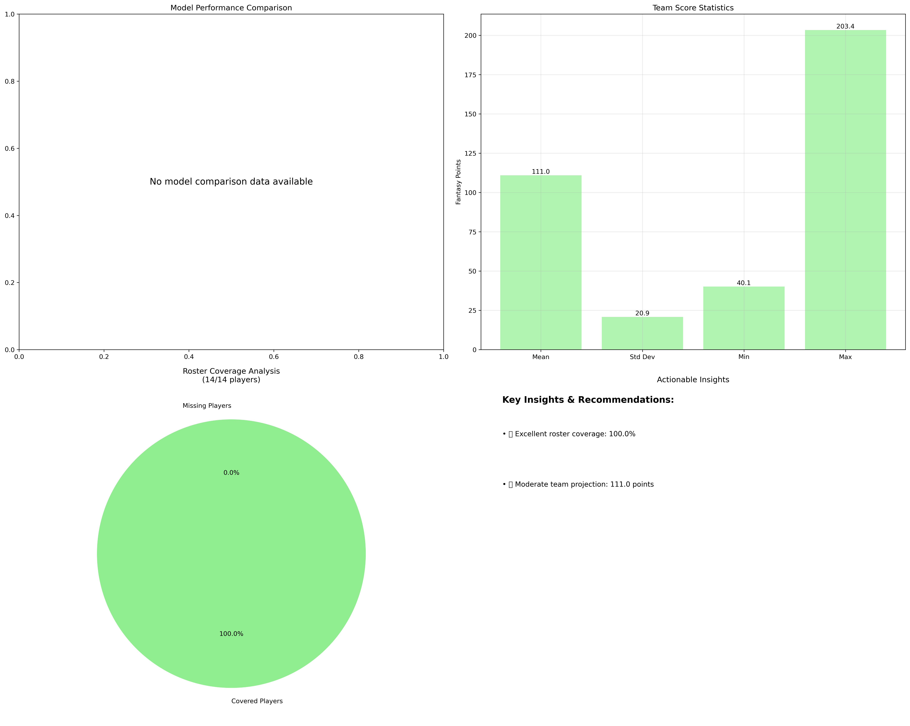

# FFBayes: Fantasy Football Analytics Pipeline

A complete fantasy football analytics pipeline that generates tiered draft strategies using Bayesian modeling and Monte Carlo simulations.

## 🚀 Quick Start: Generate Your Draft Strategy

Want to get your tiered fantasy football draft list right now? Run this:

```bash
# Install the package
pip install -e .

# Preferred: one command to generate a complete draft strategy (Phase A)
ffbayes-pipeline --phase draft
```

This will give you a complete tiered draft strategy with:
- **Primary targets** for each pick
- **Backup options** if your targets are gone
- **Fallback options** for late-round steals
- **Position scarcity analysis**
- **Uncertainty quantification**

## 📊 Complete Pipeline: From Data to Draft Strategy

### Preferred: One-command runs via CLI
```bash
# Phase A: Draft-only
ffbayes-pipeline --phase draft

# Phase B: Post-draft validation (requires your team TSV)
ffbayes-pipeline --phase validate --team-file my_ff_teams/my_actual_2025.tsv

# Full pipeline (uses enhanced orchestrator when available)
ffbayes-pipeline --phase full
```

## 🧪 Post-Draft Validation (Phase B)
After your real draft, validate your team via Monte Carlo:
```bash
ffbayes-pipeline --phase validate --team-file my_ff_teams/my_actual_2025.tsv
```

## 🎯 How the Models Work

### Bayesian Hierarchical Model (Step 1: Propose)
- **Purpose:** Player-level predictions with uncertainty
- **Method:** PyMC4 hierarchical model accounting for team effects, position, and player history
- **Input:** Player performance, team matchups, position data
- **Output:** Individual player projections with confidence intervals
- **Visualization:** `plots/bayesian_model/` - Model diagnostics and predictions

### Draft Strategy Generation (Step 2: Optimize)
- **Purpose:** Tiered draft recommendations
- **Method:** Uses Bayesian predictions to create optimal team construction
- **Input:** Bayesian player projections + position scarcity + uncertainty analysis
- **Output:** Multiple options per pick with reasoning and uncertainty analysis

### Monte Carlo Validation (Step 3: Evaluate - Adversarial!)
- **Purpose:** Adversarial validation of draft strategies
- **Method:** Simulates thousands of outcomes for drafted teams to test strategy performance
- **Input:** Drafted team compositions from strategy
- **Output:** Team performance validation and strategy effectiveness
- **Visualization:** `plots/monte_carlo/` - Team performance distributions

### Phases & metrics (cheat sheet)
- **Monte Carlo team simulation (Phase B)**
  - For your drafted team, we simulate weekly team scores by sampling historical player game scores from the last 5 seasons (with guardrails and fallbacks when history is sparse).
  - For each simulation: sample a historical week for every rostered player, sum to a team total; repeat thousands of times.
  - We summarize the distribution with mean, std, min/max, percentiles, and a 95% CI using mean ± 1.96 × SE.
- **Draft strategy (Phase A)**
  - Tiers are created from season‑level predicted points and uncertainty; risk tolerance tilts toward safer or higher‑variance options.
  - For each pick, the strategy proposes primary/backup/fallback options factoring position scarcity and roster construction.
  - Outputs saved to `results/draft_strategy/` as timestamped JSON.
- **Metrics used in visuals**
  - Coefficient of Variation (CV): std/mean per player; higher implies greater volatility.
  - Contribution %: a player’s mean points divided by the sum of team means.
  - Team CI: mean ± 1.96 × (std/√N_sims).

## 📈 Available Visualizations

### Example Outputs (from your latest run)

- Team Score Breakdown
  

- Position Analysis
  

- Uncertainty Analysis
  

- Comparison Insights
  

### How to read the visuals
- Player insights: Sorted by contribution with position-aware colors. Slender whisker error bars show mean ± std; labels include positions. Ordering reduces overlap and highlights impact.
- Position analysis: Aggregates by true positions (not UNK), sorted by total points. Panels show total points, average per player, share of team points, and player count—useful for roster balance and position scarcity.
- Uncertainty analysis: Left-top relates contribution vs CV (who contributes most and is volatile); left-bottom shows mean vs std (consistency vs output). Top-right is the distribution of player CV; bottom-right is the team score PDF with 95% CI and key percentiles—gives a realistic weekly range.
- Comparison insights: Annotated team metrics (mean, std, min/max, 95% CI, percentiles) plus roster coverage pie (how many listed players had valid historical data). The model-comparison panel shows MAE for Bayesian vs the "Baseline" predictor; lower is better.

> Baseline = a simple 7‑game moving average for each player (no modeling/covariates). It’s used as a sanity check; MAE is computed on the same test split as the Bayesian model.

## 🔬 Technical Notes: How estimates are produced

- Data preparation
  - Last 5 seasons are combined into `datasets/combined_datasets/*season_modern.csv` and cleaned (position normalization, outlier caps, injury columns preserved, home/away flag).
  - The Bayesian script trains on the penultimate season and evaluates on the latest (e.g., train 2023 → test 2024), caching traces/results in `results/bayesian-hierarchical-results/`.

### Concepts in 60 seconds
- **Bayesian model**: combines prior beliefs with observed data to produce a distribution of likely outcomes, not just a single number. You get both an estimate and its uncertainty.
- **MCMC**: a numerical method that draws many samples from that distribution when it can’t be computed directly; think “smart random walk” that explores plausible values.
- **Uncertainty**: error bars and intervals indicate how much outcomes can vary; wider bars mean more risk. Use them to balance ceiling vs stability when drafting.
- **Monte Carlo**: simulate many plausible weeks/seasons to see realistic ranges (floor/median/ceiling) for your team’s total score.
- **Baseline vs model**: we benchmark against a simple 7‑game moving average; the model should beat this on held‑out data (lower MAE).

### Generative model (quick overview)
- Baseline: 7-game moving average (per player). 

```math
\hat{y}_{it}^{(\mathrm{baseline})} = \frac{1}{\min(7, t-1)} \sum_{s=1}^{\min(7, t-1)} y_{i,t-s}
```

Uses available history if fewer than 7 prior games; no opponent/team/home effects.

For Bayesian model below, data is index as player $i$ in week $t$, positions in {QB, WR, RB, TE} and teams indexed $0..T-1$. Rank $r∈{0,1,2,3}$ from quartiles of 7-game average.

- Bayesian model:
  
  Likelihood:
  ```math
  y_{it} \sim \mathrm{StudentT}(\nu, \mu_{it}, \sigma_{r(i,t)})
  ```
  
  Mean:
  ```math
  \mu_{it} = \alpha + \sum_{p \in \{QB, WR, RB, TE\}} \beta^{p}_{\mathrm{opp}(i,t)} \, \mathbb{I}\{\mathrm{pos}(i)=p\} + h^{\mathrm{pos}(i)}_{r(i,t)} \, \mathbb{I}\{home_{it}\} + a^{\mathrm{pos}(i)}_{r(i,t)} \, \mathbb{I}\{away_{it}\}
  ```
  
  Priors:
  ```math
  \beta^{p}_{\cdot} \sim \mathcal{N}(0, \tau^{p});\quad h^{p}_{r},\ a^{p}_{r} \sim \mathcal{N}(0, \tau^{p}_{r});\quad \sigma_{r} \sim \mathrm{HalfNormal}(\sigma_0);\quad \nu = 1 + \exp(\eta)
  ```

  Defense effect by position:
  ```math
  \text{defense}_{it} = \mathbb{I}\{\mathrm{pos}(i)=QB\}\,\beta^{QB}_{\mathrm{opp}(i,t)} + \mathbb{I}\{\mathrm{pos}(i)=WR\}\,\beta^{WR}_{\mathrm{opp}(i,t)} + \mathbb{I}\{\mathrm{pos}(i)=RB\}\,\beta^{RB}_{\mathrm{opp}(i,t)} + \mathbb{I}\{\mathrm{pos}(i)=TE\}\,\beta^{TE}_{\mathrm{opp}(i,t)}
  ```

  Home/away offsets by position and rank r:
  ```math
  \text{offsets}_{it} = h^{\mathrm{pos}(i)}_{r(i,t)} \, \mathbb{I}\{home_{it}\} + a^{\mathrm{pos}(i)}_{r(i,t)} \, \mathbb{I}\{away_{it}\}
  ```

  Observed inputs used in the model: `FantPt`, 7-game rolling average `7_game_avg`, position one-hots (`position_QB`, `position_WR`, `position_RB`, `position_TE`), opponent team index `opp_team`, rank `rank` (quartiles of `7_game_avg` per player-season), and `is_home`.

  Train/test split: latest two seasons from the combined 5-year dataset (train second-latest; test latest).

  Outputs: posterior predictive mean and std for each player-week; MAE is reported vs held-out actuals and compared to the 7-game-average baseline.

#### Baseline predictor (details)
- For each player–game in the test set, the baseline predicts the 7‑game moving average of that player’s prior games (if fewer than 7 exist, use what’s available). It ignores opponent, team effects, and home/away.
- We compute MAE for this baseline and for the Bayesian model on the same held‑out split; these appear in `modern_model_results.json` as `mae_baseline` and `mae_bayesian` and feed the Comparison Insights panel.
- Why keep it? It’s a strong, transparent benchmark; the model should consistently match or beat it to justify added complexity.

### Diagnostics & reproducibility
- Convergence checks: inspect R‑hat (≈1.00 is good), effective sample size (ESS), and trace plots.
  - Saved ArviZ artifacts/plots (if enabled by your environment) live under `plots/bayesian_model/`.
  - ArviZ docs: https://python.arviz.org for interpreting R‑hat, ESS, and posteriors.
- Re‑run the Bayesian stage to refresh results and diagnostics:
  - `ffbayes-bayes` (uses cached trace if present; reruns if config/data changed).
- All Monte Carlo inputs/outputs are under `results/montecarlo_results/` and `results/team_aggregation/`; drafts under `results/draft_strategy/`.

## 📋 Example Draft Strategy Output

```json
{
  "strategy": {
    "Pick 3": {
      "primary_targets": ["Lamar Jackson", "Ja'Marr Chase", "Josh Allen"],
      "backup_options": ["Saquon Barkley", "Joe Burrow", "Jahmyr Gibbs"],
      "fallback_options": ["Rashee Rice", "Jayden Daniels", "Baker Mayfield"],
      "position_priority": "QB > TE > RB",
      "reasoning": "TE depth available, early pick - target elite players",
      "uncertainty_analysis": {
        "risk_tolerance": "medium",
        "primary_avg_uncertainty": 0.101,
        "overall_uncertainty": 0.096
      }
    }
  }
}
```

## 🔧 Configuration Options

### Draft Strategy Parameters
```bash
ffbayes-draft-strategy \
  --draft-position 3 \        # Your draft position (1 - [LEAGUE_SIZE])
  --league-size 12 \          # League size (8, 10, 12, 14, 16)
  --risk-tolerance low \      # Risk level (low, medium, high)
  --output-file strategy.json # Save to file
```

### Pipeline Options
```bash
# Quick test mode (faster, less data)
ffbayes-collect --quick-test
ffbayes-mc --quick-test

# Force refresh (reprocess existing data)
ffbayes-collect --force-refresh

# Custom data directory
ffbayes-collect --data-dir /path/to/data
```

## 📁 File Structure

```
ffbayes/
├── datasets/
│   ├── season_datasets/          # Raw NFL data by year
│   └── combined_datasets/        # Processed 5-year datasets
├── results/
│   ├── montecarlo_results/       # Team simulations
│   ├── bayesian-hierarchical-results/  # Player predictions
│   ├── team_aggregation/         # Combined analysis
│   └── draft_strategy/           # Draft strategy outputs
├── plots/
│   ├── bayesian_model/           # Model diagnostics
│   ├── team_aggregation/         # Team analysis
│   └── monte_carlo/              # Simulation results
├── config/
│   └── pipeline_config.json      # Pipeline configuration
└── my_ff_teams/                  # Your team configurations
```

## 🧪 Testing

Run the full test suite:
```bash
python -m pytest tests/ -v
```

Test individual components:
```bash
python -m pytest tests/test_draft_strategy.py -v
python -m pytest tests/test_monte_carlo.py -v
```

## 🐛 Troubleshooting

### Common Issues

**"No combined datasets found"**
```bash
# Regenerate the combined dataset
ffbayes-preprocess
```

**"Monte Carlo results not found"**
```bash
# Run Monte Carlo simulation
ffbayes-mc --team-file my_ff_teams/my_actual_2025.tsv
```

**"Bayesian results not found"**
```bash
# Run Bayesian modeling
ffbayes-bayes
```

### Data Issues
- Check `datasets/season_datasets/` for raw data files
- Verify internet connection for data collection
- Ensure sufficient disk space for results

## 📊 Performance

- **Data Collection:** ~5 minutes for 5 years of data
- **Monte Carlo:** ~10-15 minutes for 70,000 simulations
- **Bayesian Modeling:** ~20-30 minutes for full model
- **Draft Strategy:** ~30 seconds for complete tiered list

## 🤝 Contributing

1. Fork the repository
2. Create a feature branch
3. Add tests for new functionality
4. Submit a pull request

## 📄 License

MIT License - see LICENSE file for details.

## 📝 Appendix: Advanced/Manual Commands
If you prefer granular control, you can run individual stages:

- Draft strategy only (assumes data/model already prepared):
```bash
ffbayes-draft-strategy --draft-position 3 --league-size 12 --risk-tolerance medium
```

- Individual stages manual flow:
```bash
ffbayes-collect
ffbayes-validate
ffbayes-preprocess
ffbayes-bayes
ffbayes-draft-strategy --draft-position 3 --league-size 12 --risk-tolerance medium
ffbayes-mc --team-file my_ff_teams/my_actual_2025.tsv
```

#### Data used by the model (from the pipeline)

- Source collection: `nfl_data_py` weekly player data and schedules; optional injuries. See `src/ffbayes/data_pipeline/collect_data.py`.
- Preprocessing (last 5 seasons):
  - Merge schedules to derive `is_home`, opponent `Opp`/`opp_team` indices.
  - Compute `7_game_avg` per player-season and quartile `rank` (0–3).
  - One-hot positions; keep essential columns and compute `diff_from_avg = FantPt - 7_game_avg`.
  - Save combined dataset to `datasets/combined_datasets/*season_modern.csv`.

These features feed the Bayesian model exactly as specified above.

#### Notation (and column mapping)

- i: player index; corresponds to a row's `Name`/`player_id` grouping.
- t: week index within a season; corresponds to `G#`/`week` within `Season`.
- y_{it}: observed PPR fantasy points for player i in week t → `FantPt` (or `fantasy_points_ppr` upstream).
- \bar{y}^{(7)}_{i,t}: rolling 7-game average for player i before week t → `7_game_avg`.
- r(i,t): quartile rank of `7_game_avg` for player i in that season → `rank` in {0,1,2,3}.
- pos(i): position of player i (QB/WR/RB/TE) → one-hot indicators `position_QB`, `position_WR`, `position_RB`, `position_TE`.
- opp(i,t): opponent team index faced by i in week t → `opp_team` (derived from `Opp`).
- home_{it}: home indicator for i in week t (1 if home, 0 if away) → `is_home`.
- team(i,t): player team index (used in preprocessing and visuals) → `team` (derived from `Tm`).

All symbols in equations correspond directly to these columns produced by `collect_data.py` and `preprocess_analysis_data.py`.

#### Symbol legend (model-specific)

- $\alpha$: global intercept (baseline level).
- $\mu_{it}$: latent mean for player $i$ in week $t$.
- $\beta^{p}_{\mathrm{opp}(i,t)}$: opponent-by-position effect for position $p\in\{QB,WR,RB,TE\}$ against the opponent faced in week $t$.
- $h^{\mathrm{pos}(i)}_{r(i,t)}$: home offset for player $i$'s position and rank $r(i,t)$.
- $a^{\mathrm{pos}(i)}_{r(i,t)}$: away offset for player $i$'s position and rank $r(i,t)$.
- $\mathbb{I}\{\cdot\}$: indicator function (1 if condition is true, else 0).
- $\sigma_{r}$: rank-specific residual scale used in the likelihood.
- $\tau^{p}$, $\tau^{p}_{r}$: prior scales (standard deviations) for effects by position and position-by-rank.
- $\nu$: Student-T degrees of freedom; parameterized as $\nu = 1+\exp(\eta)$ to enforce $\nu>1$.
- $\eta$: unconstrained real parameter for $\nu$.
- $home_{it}$, $away_{it}$: binary indicators for home/away; $away_{it}=1-home_{it}$.
- $\text{defense}_{it}$: shorthand for the opponent-by-position sum of $\beta$ effects.
- $\mathrm{StudentT}(\nu,\mu,\sigma)$: Student-T distribution with df $\nu$, location $\mu$, scale $\sigma$.