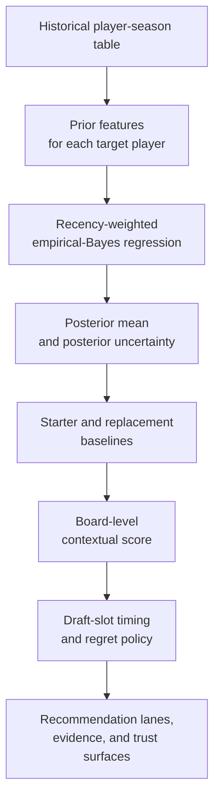
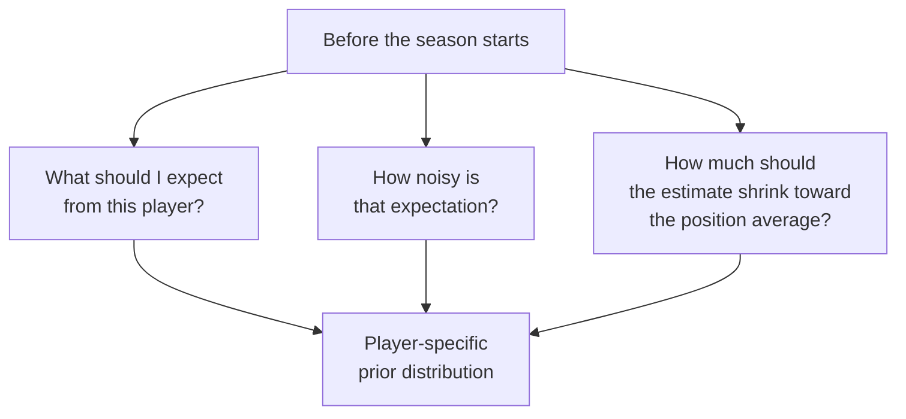
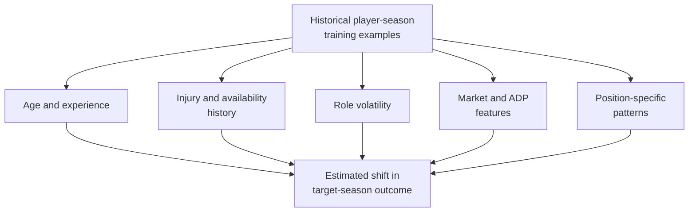
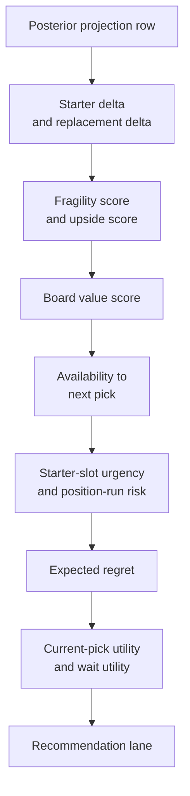
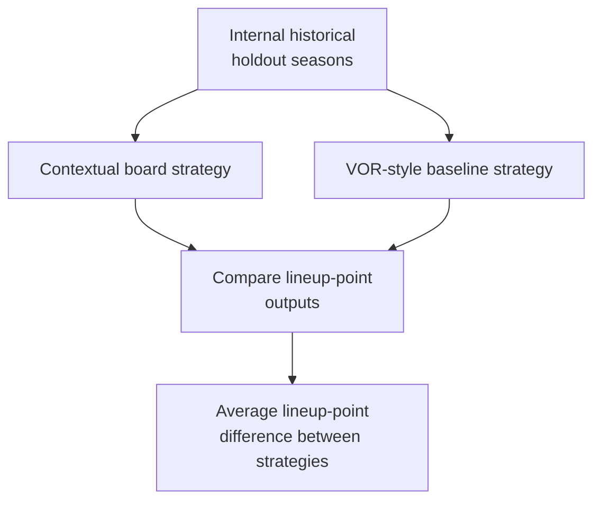

# Technical Deep Dive

Audience: statisticians, technical reviewers, and contributors who need the implemented board math instead of a conceptual marketing summary.

Scope: the supported `pre-draft` workflow, the implemented player-posterior model, the board-construction layer, the recommendation policy, and the current trust surfaces.

Trust boundary: this document describes the implemented current board. Additional non-default analyses are labeled explicitly. Internal holdout backtests are directional evidence, not external validation.

When a rank-based validation slice cannot be estimated because the slice is constant or lacks variation, the emitted artifact records that metric as unavailable and operator-facing surfaces render it as `n/a` or `not estimable`. That state is not equivalent to a measured zero relationship.

## What This Is

This is the single authoritative technical and methods guide for the draft board.

The key distinction is:

- implemented current board behavior: what the supported `pre-draft` board actually does
- conceptual intuition: simplified explanations for why the implemented math is structured that way
- additional non-default analyses: commands that exist but are not the default pre-draft operator path

## When To Use It

Use this document when you need to answer questions like:

- what is the actual forecast target?
- how are priors and posterior estimates combined?
- what do `Board value score`, `Simple VOR proxy`, `Expected regret`, and `Fragility score` mean mathematically?
- what does the evidence panel validate, and what does it not validate?

## What To Inspect

Primary implementation sources:

- `src/ffbayes/analysis/bayesian_player_model.py`
- `src/ffbayes/draft_strategy/draft_decision_system.py`
- `src/ffbayes/draft_strategy/draft_decision_strategy.py`
- `src/ffbayes/analysis/draft_retrospective.py`
- `config/pipeline_pre_draft.json`

Primary emitted artifacts:

- `seasons/<year>/draft_strategy/dashboard_payload_<year>.json`
- `seasons/<year>/draft_strategy/draft_board_<year>.html`
- `seasons/<year>/draft_strategy/draft_decision_backtest_<year_range>.json`
- `site/dashboard_payload.json`
- `site/publish_provenance.json`

## Interpretation Boundaries

- The board is driven by posterior player projections plus a decision policy.
- `Simple VOR proxy` is a baseline comparator; the contextual board score also uses starter advantage, replacement advantage, uncertainty, market gap, roster need, timing, and regret.
- Player forecasts use the hierarchical empirical-Bayes estimator.
- Internal holdout backtests are directional evidence, not external validity.
- Floor and ceiling fields are posterior percentile summaries unless another range is explicitly defined.

## Under The Hood In One Pass

If you want the shortest mathematically honest summary, the current board does this:



The important thing to notice is that there are two different mathematical layers:

1. a player-level posterior layer
2. a draft-decision policy layer

That separation is the main reason the board can be confusing if the document only shows a few equations. A player can have a strong posterior projection but still be a weaker "pick now" recommendation if timing and roster context say waiting is fine.

## Bayesian Terms Used Here

This document uses Bayesian language because the board carries uncertainty
forward instead of reducing every player to one fixed projection. The terms are
technical, but the core idea is simple: start with what is known before the
season, update that expectation using historical evidence, then keep both the
central estimate and the uncertainty around it.

### Prior

A `prior` is the model's draft-time starting expectation before the final
regression update. In this project, it is not a hand-written opinion and not a
single projection column. It is a structured estimate built from draft-time-safe
information such as recent player performance, scoring rate, games played,
position context, age, team change, role volatility, ADP, market disagreement,
and rookie context when a player has little or no NFL history.

The prior answers:

- what should this player probably score before the new season starts?
- how uncertain should that expectation be?
- how much should a thin or noisy player history move back toward the position
  average?

### Likelihood

The `likelihood` is the part of the model that asks how compatible the historical
training data are with a proposed relationship between features and future
fantasy points. In implementation terms, the likelihood comes from a weighted
regression over historical player-season examples. Recent seasons receive more
weight than older seasons.

The likelihood answers:

- when players had features like this in past draft-time data, what happened in
  the target season?
- which features are consistently informative across historical examples?
- how noisy is that relationship?

### Posterior

A `posterior` is the updated distribution after combining the prior and the
historical regression evidence. It is a distribution, not just one number. That
matters because two players can have similar central projections while one is
much less certain.

When the dashboard shows a posterior field, read it as:

- `posterior_mean`: the central season-total fantasy-points estimate after the
  model update
- `posterior_std`: the width of uncertainty around that estimate
- `posterior_floor` and `posterior_ceiling`: approximate lower and upper outcome
  percentiles from simulated season-total posterior draws
- `posterior_prob_beats_replacement`: the model-implied probability that the
  player clears a replacement baseline

### Posterior Mean

The `posterior_mean` is the model's best central estimate for a player's
season-total fantasy points after the prior and regression evidence have been
combined. It is not a guarantee, not a median draft rank, and not by itself the
draft recommendation.

The draft board uses the posterior mean as an input to later board logic. The
recommendation can still change after accounting for starter baselines,
replacement baselines, roster need, next-pick availability, and expected regret.

### Uncertainty

`Uncertainty` means the model is less sure where the player's true season
outcome will land. It can come from thin history, unstable role, injury or games
missed history, team change, volatile scoring rate, noisy market signals, or
weak historical comparability.

Higher uncertainty does not automatically mean "avoid." It means the board
should treat the projection as wider. That can create downside risk, but it can
also preserve upside when the central estimate is strong and the ceiling is
meaningful.

### Shrinkage

`Shrinkage` means pulling an estimate away from an extreme player-specific value
and toward a broader reference point, usually a position average or a learned
population pattern. This is useful when a player's own history is thin, noisy, or
possibly misleading.

For example, one explosive partial season should not be treated the same as five
stable seasons. Shrinkage lets the model use the partial-season signal without
pretending it is equally reliable.

### Empirical Bayes

`Empirical Bayes` means the model uses the data to estimate parts of the prior
and update structure instead of relying entirely on subjective hand-set beliefs.
Here, historical player-season data define the feature relationships and
uncertainty behavior, while the player-specific prior features give each target
player a draft-time starting point.

In this project, posterior player fields come from a transparent hierarchical
empirical-Bayes estimator with closed-form updates and explicit uncertainty
fields.

## Implemented Workflow

The supported `pre-draft` runner in `config/pipeline_pre_draft.json` performs:

1. data collection
2. data validation
3. preprocessing
4. unified dataset creation
5. optional traditional VOR baseline artifact generation
6. draft decision strategy
7. draft decision backtest

The default operator-facing board comes from step 6. Player-forecast generation
is internal to `draft_decision_strategy`, and evidence is supplied by step 7.

## Forecast Target And Decision Target

### Forecast Target

The implemented player model in `bayesian_player_model.py` forecasts season-total fantasy points for the target season by modeling scoring rate and availability separately, then composing them through posterior predictive simulation.

The main exported player-level outputs are:

- `posterior_mean`
- `posterior_std`
- `posterior_floor`
- `posterior_ceiling`
- `posterior_prob_beats_replacement`
- `uncertainty_score`

### Decision Target

The draft board does not stop at a player projection. It converts player-level posterior outputs into a draft-time decision surface:

- who is strongest on raw board value?
- who is strongest relative to starter and replacement baselines?
- who is likely to survive to the next pick?
- how costly is it to wait?
- how does current roster need change the action?

That second layer is what turns a projection table into a draft board.

## Player Prior Construction

The prior features come from `_player_prior_features(...)` in `bayesian_player_model.py`.

For a player with history, the prior structure is built from separate rate and availability components.

The rate prior mean is a shrinkage blend of recent player rate and position rate, with team-season context allowed to adjust it:

```math
\mathrm{prior\_rate\_mean}
=
\mathrm{shrinkage}\cdot \mathrm{recent\_rate}
+ (1-\mathrm{shrinkage})\cdot \mathrm{position\_rate\_mean}
```

Where:

- `recent_rate` is the recent scoring rate when active
- `position_rate_mean` is the historical rate average for the position
- `shrinkage` is:

```math
\mathrm{shrinkage}
=
\frac{\mathrm{season\_count}}{\mathrm{season\_count}+2.5}
```

The constant `2.5` is a prior-strength setting. It makes the position-level
reference behave like roughly two and a half stabilizing seasons. With one NFL
season of player history, the player-specific rate receives about:

```math
\frac{1}{1+2.5}\approx 0.29
```

of the blend. With five seasons, it receives about:

```math
\frac{5}{5+2.5}\approx 0.67
```

That is deliberate: one season should move the prior, but it should not erase
the position context.

The availability prior mean is built from weighted historical games played, with team-season context allowed to adjust it:

```math
\mathrm{prior\_games\_mean}
=
\mathrm{weighted\ historical\ games\ played}
```

Season-total priors are then composed from those two components. The production season-total posterior is not a direct one-stage mean-only regression.

If a player has no usable history, the prior is driven by position context plus explicit rookie inputs such as draft capital, combine-derived signal, and depth-chart context rather than pretending to know a player-specific NFL history.

### What Data Enters The Prior

The prior is not built from one raw projection column. It is built from a draft-time-safe feature bundle that includes:

- season-total fantasy points from prior seasons
- scoring rate from prior seasons
- games played and games missed
- age and years in league
- team-season context and team-change indicators
- rookie draft-capital, combine, and depth-chart context when available
- team-change rate
- role volatility
- recent ADP and ADP rank
- prior VOR-style values and market-proxy values
- site disagreement and related market instability features

The prior is trying to answer three linked questions:



### Recency Weighting

Historical seasons are weighted with exponential decay:

```math
w_s
=
d^{\mathrm{target\_season}-s}
```

where `d = 0.72` in `_recency_weights(...)`.

That means:

- last season gets the most weight
- older seasons still matter
- old seasons are down-weighted rather than thrown away entirely

The value `0.72` means each additional year back keeps 72 percent of the prior
year's weight. For example:

```math
w_{\mathrm{last\ year}} = 0.72
\qquad
w_{\mathrm{two\ years\ back}} = 0.72^2 \approx 0.52
\qquad
w_{\mathrm{three\ years\ back}} = 0.72^3 \approx 0.37
```

So the model favors recent form while still allowing older seasons to stabilize
thin histories.

### Replacement Baseline In The Prior

Even before the draft board is built, `_player_prior_features(...)` computes a position-level replacement baseline from the position scoring distribution:

```math
\mathrm{replacement\_baseline}
=
Q_{0.20}(\mathrm{position\_points})
```

The default replacement quantile is:

```math
\mathrm{replacement\_quantile}=0.20
```

That gives the player model an early notion of "beats replacement" before the board later recomputes league-shape-specific baselines.

The 20th percentile is intentionally a low position-specific reference point,
not a median starter threshold. At this stage the model needs a broad
"replacement-level" anchor for posterior probability calculations; the later
draft-board layer computes league-shape-specific starter and replacement
baselines again.

## Empirical-Bayes Regression Layer

`fit_bayesian_regression(...)` fits a transparent empirical-Bayes linear model with recency weighting.

Inputs include:

- prior mean and prior standard deviation
- recent and latest points
- weighted player mean and volatility
- trend, injury, age, team-change, and role-volatility features
- ADP, VOR-style, and market-proxy features
- position indicators

Recent seasons are weighted more heavily with:

```math
w
=
\exp(-0.18\cdot \mathrm{season\_gap})
```

The `0.18` decay coefficient is the regression-layer recency penalty. It implies
roughly:

```math
\exp(-0.18)\approx 0.84
\qquad
\exp(-0.36)\approx 0.70
\qquad
\exp(-0.54)\approx 0.58
```

for examples one, two, and three seasons behind the most recent training season.
This is milder than dropping old examples outright. The regression still learns
from older data, but the newest player-season relationships contribute more.

This regression produces:

- `regression_mean`
- `regression_std`

### Regression Model Form

At this stage the model is doing weighted linear regression with a Gaussian prior on coefficients:

```math
y = X\beta + \varepsilon
```

```math
\varepsilon \sim \mathcal{N}(0,\ \sigma^2_{\mathrm{obs}})
\qquad
\beta \sim \mathcal{N}\!\left(0,\ \Lambda_{\mathrm{prior}}^{-1}\right)
```

Where:

- `y` is target-season fantasy points in the training examples
- `X` contains standardized numeric features plus position indicators
- the coefficient prior acts like regularization

The implementation solves this in precision form:

```math
\Sigma
=
\left(
\Lambda_{\mathrm{prior}} + \tau X^\top W X
\right)^{-1}
```

```math
\mu_\beta
=
\tau \Sigma X^\top W y
```

where:

- `W` is the diagonal matrix of recency weights
- `\tau = 1 / observation_variance`
- `\Lambda_{\mathrm{prior}}` is the coefficient-prior precision matrix

This is why the document calls it empirical Bayes rather than a fully hand-tuned subjective prior: the regression structure is learned from the historical examples, then combined with shrinkage and coefficient regularization.

### Why This Regression Exists At All

The prior layer alone would mostly say:

- what this player did recently
- how volatile that player was
- what this position usually looks like

The regression layer adds a second question:



That is what allows the board to generalize beyond a naive "last season plus shrinkage" rule.

## Posterior Combination

The final posterior combines the prior distribution with the empirical-Bayes regression estimate in closed form:

```math
\mathrm{posterior\_var}
=
\frac{1}{
\frac{1}{\mathrm{prior\_var}}
+
\frac{1}{\mathrm{regression\_var}}
}
```

```math
\mathrm{posterior\_mean}
=
\mathrm{posterior\_var}
\left(
\frac{\mathrm{prior\_mean}}{\mathrm{prior\_var}}
+
\frac{\mathrm{regression\_mean}}{\mathrm{regression\_var}}
\right)
```

The player table then exports:

- `posterior_rate_mean` and `posterior_rate_std`
- `posterior_games_mean` and `posterior_games_std`
- `posterior_mean`
- `posterior_std`
- `posterior_floor`
- `posterior_ceiling`

The season-total posterior is composed by simulation:

```math
r^{(m)} \sim \mathcal{N}(\mu_{\mathrm{rate}},\sigma^2_{\mathrm{rate}})
\qquad
g^{(m)} \sim \mathcal{N}(\mu_{\mathrm{games}},\sigma^2_{\mathrm{games}})
```

```math
y^{(m)} = \max(r^{(m)},0)\cdot \mathrm{clip}(g^{(m)},0,\mathrm{expected\_games})
```

with `512` draws per player. The exported summaries are:

```math
\mathrm{posterior\_mean}
=
\frac{1}{512}\sum_{m=1}^{512} y^{(m)}
```

```math
\mathrm{posterior\_floor}
=
Q_{0.10}\!\left(y^{(1)},\ldots,y^{(512)}\right)
\qquad
\mathrm{posterior\_ceiling}
=
Q_{0.90}\!\left(y^{(1)},\ldots,y^{(512)}\right)
```

The 10th and 90th percentiles are chosen as a readable downside/upside band.
They are not a 95 percent confidence interval of the mean. The draw count `512`
is an implementation balance: enough draws to produce stable dashboard
summaries, small enough to keep repeated backtests and dashboard generation
fast.

`posterior_prob_beats_replacement` is the posterior probability that the player clears the position replacement baseline:

```math
\Pr(Y > R)
=
\Phi\left(
\frac{\mathrm{posterior\_mean}-R}{\max(\mathrm{posterior\_std},1)}
\right)
```

where `R` is the replacement baseline and `\Phi` is the standard Normal CDF. The
`\max(\mathrm{posterior\_std},1)` denominator prevents unstable probabilities
when a simulated posterior spread is extremely small.

### Intuition For The Posterior Combination

This is a precision-weighted average:

- if the prior is tight and the regression estimate is noisy, the posterior stays closer to the prior
- if the regression estimate is tight and the prior is wide, the posterior moves more toward the regression estimate
- if both are uncertain, the posterior variance stays wider

So the system is not "averaging two scores." It is averaging two uncertain distributions.

### One-Player Walkthrough

For a single player, the chain is:

```math
\text{historical seasons}
\rightarrow
\left(
\mathrm{recent\_mean},
\mathrm{player\_trend},
\mathrm{player\_weighted\_std},
\mathrm{position\_mean},
\mathrm{replacement\_baseline}
\right)
\rightarrow
(\mathrm{prior\_mean},\mathrm{prior\_std})
\rightarrow
(\mathrm{regression\_mean},\mathrm{regression\_var})
\rightarrow
(\mathrm{posterior\_mean},\mathrm{posterior\_std})
\rightarrow
(\mathrm{posterior\_floor},\mathrm{posterior\_ceiling},\Pr[\text{beats replacement}])
```

That player table is the input to the draft board. The board does not go back to raw weekly simulation draws at this point.

## Baselines Used By The Board

The board uses two distinct baselines in `draft_decision_system.py`:

- `starter_baseline`: a position-specific baseline derived from league starter slots
- `replacement_baseline`: a position-specific baseline derived from effective replacement slots

These create:

```math
\mathrm{starter\_delta}
=
\mathrm{proj\_points\_mean} - \mathrm{starter\_baseline}
```

```math
\mathrm{replacement\_delta}
=
\mathrm{proj\_points\_mean} - \mathrm{replacement\_baseline}
```

The dashboard label for `replacement_delta` is `Simple VOR proxy`. That is a baseline comparator, not the full contextual board.

### How The Baselines Are Computed

The board recomputes league-shape-specific baselines using `_position_baseline(...)`:

```math
\mathrm{baseline}(\mathrm{position},\mathrm{slot\_count})
=
\text{projection of the player ranked at slot\_count within that position}
```

So if the league shape changes, the starter and replacement baselines can move even when the player posterior table does not.

This matters because:

- `starter_delta` is about lineup advantage
- `replacement_delta` is about replacement-level advantage

Those are related but not identical targets.

## Risk, Upside, And Market Signals

The board then creates additional signals from posterior and historical features.

### Fragility Score

`Fragility score` combines:

- limited historical depth
- games missed and injury-related penalties
- age
- team changes
- role volatility
- site disagreement or ADP spread
- posterior unreliability through `1 - posterior_prob_beats_replacement`

Higher values mean the player profile is shakier.

### Upside Score

`Upside score` combines:

- ceiling-over-mean gap
- posterior probability of beating replacement
- next-pick survival rank percentile
- raw projection rank percentile

Higher values mean more ceiling and breakout leverage.

### Market Gap

`market_gap = market_rank - model_rank`

Positive values mean the current model likes the player more than the market cost suggests.

## Implemented Board Value Formula

The implemented board foundation is `board_value_score`:

```math
\mathrm{board\_value\_score}
=
0.40\,z(\mathrm{proj\_points\_mean})
+ 0.24\,z(\mathrm{starter\_delta})
+ 0.18\,z(\mathrm{replacement\_delta})
+ 0.10\,z(\Pr[\text{beats replacement}])
+ 0.06\,z(\mathrm{market\_gap})
+ 0.03\,z(\mathrm{starter\_need})
- \left(0.06\cdot \mathrm{risk\_multiplier}\right) z(\mathrm{fragility\_score})
```

Where `risk_multiplier` depends on risk tolerance:

- low: `0.80`
- medium: `1.00`
- high: `1.18`

The exported `draft_score` is currently this `board_value_score`. The dashboard labels it `Board value score`.

The board-value weights are policy weights, not regression coefficients learned
directly from the backtest. They encode the intended ordering of concerns:

```math
0.40 > 0.24 > 0.18 > 0.10 > 0.06 > 0.03
```

The largest term keeps the board anchored to the central posterior projection.
The next two terms give starter and replacement advantage real influence, so the
board is not just a raw points sort. Smaller terms let replacement probability,
market gap, and current starter need break ties or nudge close calls without
dominating the core projection. The fragility penalty is deliberately modest and
risk-adjusted:

```math
\mathrm{fragility\ penalty}
=
0.06\cdot \mathrm{risk\_multiplier}\cdot z(\mathrm{fragility\_score})
```

so changing risk tolerance changes how much shakiness hurts the score, while
preserving the same base board-value structure.

### Why Everything Is Z-Scored Here

The board combines terms measured on different scales:

- fantasy points
- probabilities
- rank gaps
- risk scores

Using `z(...)` puts these on a common standardized scale so the weights act on comparable inputs rather than letting one raw unit dominate only because it has a larger numeric range.

### What The Score Is Actually Doing

The formula can be read as:

```math
\text{good projection}
+ \text{starter advantage}
+ \text{replacement advantage}
+ \text{confidence of clearing replacement}
+ \text{some market-disagreement alpha}
+ \text{a little roster-need context}
- \text{fragility penalty}
```

That is why `Board value score` is best interpreted as a cleaned-up base ranking, not yet the final take-now/wait recommendation.

## Recommendation Policy Layer

The recommendation layer is separate from the raw board value ordering.

### Availability To Next Pick

`Availability to next pick` is a next-pick survival estimate built from ADP, ADP dispersion, and uncertainty.

The implementation uses a logistic transform:

```math
z = \frac{\mathrm{ADP} - \mathrm{target\_pick}}{\mathrm{spread}}
```

```math
\mathrm{availability\_to\_next\_pick}
=
\frac{1}{1+\exp(-z)}
```

with:

- `spread = adp_std` when available
- a fallback spread if ADP dispersion is missing
- additional widening from `uncertainty_score`

So the idea is:

- if ADP is much later than your next pick, survival rises
- if ADP is much earlier than your next pick, survival falls
- more uncertainty widens the spread and softens confidence

### Position Run Risk

`Position run risk` is derived from the remaining count at a position versus expected demand.

This is not a market model of every other drafter. It is a local scarcity heuristic tied to the currently available player pool and remaining roster demand.

### Starter Slot Urgency And Specialist Terms

The policy layer also computes:

- `starter_slot_urgency`: how much offensive starter need remains at the position
- `specialist_need_bonus`: a late-round-only bonus for DST and K when those slots still need filling
- `specialist_urgency`: a scarcity-style urgency term for late specialists

Those terms are why the action policy can differ from pure player value even when two players have similar board scores.

### Expected Regret

`Expected regret` is the wait penalty:

```math
\mathrm{expected\_regret}
=
\left(
0.55\cdot \mathrm{lineup\_gain\_percentile}
+ 0.25\cdot \mathrm{starter\_slot\_urgency}
+ 0.20\cdot \mathrm{position\_run\_risk}
\right)
\left(1-\mathrm{availability\_to\_next\_pick}\right)
```

### Action Utilities

The board computes separate utilities for acting now versus waiting:

```math
\mathrm{current\_pick\_utility}
=
\mathrm{draft\_score}
+ \mathrm{specialist\ bonuses}
+ 0.32\cdot \mathrm{starter\_slot\_urgency}
+ 0.22\cdot \mathrm{lineup\_gain\_percentile}
+ 0.08\cdot \Pr[\text{beats replacement}]
+ 0.06\cdot \mathrm{position\_run\_risk}
+ \mathrm{risk\_bias}\cdot \mathrm{upside\_score}
```

```math
\mathrm{wait\_utility}
=
\mathrm{draft\_score}\cdot \mathrm{availability\_to\_next\_pick}
+ 0.06\cdot \mathrm{upside\_score}
- 0.85\cdot \mathrm{expected\_regret}
```

That is why the recommendation lanes are not identical to the raw board ranking.

### Policy Eligibility

The board also applies gating rules before final "pick now" recommendations:

- DST and K are blocked outside the late specialist window
- secondary QB and TE picks can be suppressed when open offensive starter slots remain and the value edge is not large enough

So a player can be strong on raw board value but still be de-prioritized by the action layer.

### One Board-Row Walkthrough

For one available player at your current draft slot, the action chain is:



That is the cleanest way to think about "what is happening under the hood" on draft day.

## Decision Evidence And Validation Scope

`Decision evidence` is built from the draft-decision backtest plus freshness provenance.

The evidence surface tells you:

- whether a contextual board beat or lagged a simpler VOR-style baseline in internal holdout seasons
- how large the average lineup delta was
- which seasons were used
- what limitations apply

It does not tell you:

- that the board has been externally validated
- that the contextual score is universally better in all future leagues
- that a current recommendation is guaranteed to succeed

### What Is The Estimand Here

The evidence surface is not estimating a causal treatment effect of drafting one player. It is comparing strategy outputs on internal historical holdout seasons.

So the estimand is closer to:



That is useful for calibration and trust-building, but it should not be interpreted as a universal external estimate.

## Interval Semantics

Terms used in the current board mean different things:

- `posterior_floor` and `posterior_ceiling`: approximate 10th and 90th percentile points from simulated season-total posterior draws
- `uncertainty_score`: a normalized uncertainty-width score, not a probability
- `Availability to next pick`: a survival probability for draft timing, not a predictive interval for fantasy points
- `Expected regret`: a heuristic wait penalty, not a calibrated expected-value estimate in the causal-inference sense
- backtest summaries: internal seasonal comparison summaries, not confidence intervals of future performance

## Worked End-To-End Reading Guide

If you want to understand one dashboard row from top to bottom, read it in this order:

1. `proj_points_mean`
   This is the posterior central estimate for season-total fantasy points.
2. `proj_points_floor` and `proj_points_ceiling`
   These are approximate posterior percentile endpoints, not a 95 percent confidence interval of the mean.
3. `starter_delta`
   This asks whether the player helps your likely starting lineup.
4. `replacement_delta`
   This gives the simpler VOR-style baseline comparison.
5. `fragility_score` and `upside_score`
   These shape the risk/ceiling interpretation.
6. `draft_score` or `Board value score`
   This is the contextual base ranking.
7. `availability_to_next_pick`
   This is the timing survival estimate.
8. `expected_regret`
   This is the cost of waiting.
9. recommendation lane
   This is the action output after the policy layer.

If a reader cannot follow that chain, the document has not done its job.

## Inspector Projection Breakdown

The player inspector exposes the rate-and-availability decomposition in a dedicated `Projection breakdown` section rather than in the main board columns.

The visible inspector fields are:

- `Season total mean`
- `Rate when active`
- `Expected games`
- `Availability rate`
- `Current team`
- `Team change`

When available, the same section also shows rookie context such as draft pick, combine-derived signal, and depth-chart rank. That inspector section is explanatory. The canonical board ordering still comes from the season-total decision contract.

## War-Room Visual Semantics When Present

If the current dashboard build includes `war_room_visuals`, the visuals are derived from existing recommendation, tier-cliff, and evidence semantics:

- `wait-vs-pick frontier`: timing tradeoff between board value, survival, and wait regret
- `positional cliffs`: where position groups drop sharply
- `contextual vs baseline explainer`: why the contextual board differs from the `Simple VOR proxy`

These visuals do not create a separate model. They are interpretation surfaces built on top of the same board and evidence contract.

## Additional Commands

These commands exist outside the default `ffbayes pre-draft` operator workflow:

- `ffbayes mc`
- `ffbayes bayesian-vor`
- `ffbayes publish --year <year>`

They should not be described as the current board's primary math unless the output path and producing command are made explicit.

## Commands And Paths

Authoritative runtime artifacts:

- `seasons/<year>/draft_strategy/dashboard_payload_<year>.json`
- `seasons/<year>/draft_strategy/draft_board_<year>.html`
- `seasons/<year>/draft_strategy/draft_decision_backtest_<year_range>.json`

Derived surfaces:

- `dashboard/index.html`
- `site/index.html`
- `site/dashboard_payload.json`
- `site/publish_provenance.json`
